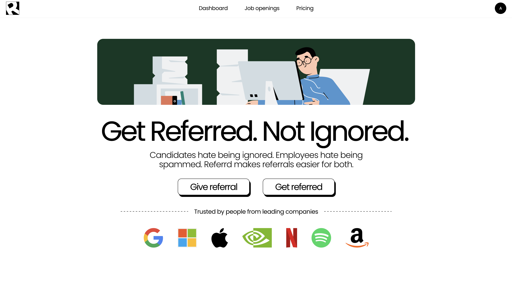

# Referrd

> **referrd.in** — A structured, AI-filtered referral platform connecting job seekers with employees who actually want to refer them.



---

## The Problem

Getting a referral on LinkedIn is broken:
- Candidates connect with 10 people, 5 accept, 1 replies — and by then the job is gone
- Employees receive hundreds of cold referral requests with no way to evaluate candidates quickly
- Most referral requests go unanswered because there is no mutual intent or filtering

---

## The Solution

Referrd creates a structured, AI-filtered referral system built on three ideas:

1. **Only employees who want to refer sign up** — no cold outreach to people who never agreed to help
2. **AI filters candidates before they reach employees** — only candidates who match the JD above a 50% threshold can send referral requests
3. **Employees receive pre-ranked, pre-filtered candidates** — instead of 100 random requests, they see the top matched candidates ready to be referred

---

## How It Works

### For Job Seekers
1. Sign up and upload resume (once, stored on profile)
2. Browse active job openings on the platform
3. Click on a job and choose to apply directly or apply with a referral
4. If applying with referral, AI scores resume against the job description
5. If score is ≥ 50, candidate sees a list of registered employees from that company
6. Candidate selects up to 3 employees and sends referral requests
7. Candidate tracks request status (pending, referred, declined, expired) from their dashboard

### For Employees
1. Sign up with work email — verified via OTP sent to work email
2. Work email domain is matched against the registered company domain
3. Receive referral requests from matched candidates in their inbox
4. Top 5 highest-matched candidates are highlighted automatically
5. Each request shows candidate name, email, AI match score, and resume download link
6. Employee clicks Refer (candidate gets referred) or Declines
7. Earns points for each referral given

### For Admin
1. Post new job openings with company, role title, JD, job link, and expiry date
2. Manage active/inactive jobs
3. View all registered employees and manually verify if needed
4. View platform stats

---

## Key Features

| Feature | Description |
|---|---|
| **AI Resume–JD Matching** | Uses Google Gemini API to score a resume against a JD. Returns score (0–100), strengths, gaps, and a one-line verdict. Score below 50 blocks referral requests. |
| **Work Email Verification** | Employees verify via OTP. Email domain validated against the company's registered domain (e.g. `@google.com` for Google). |
| **Referral Request Flow** | Candidates can send up to 3 requests per job. Requests auto-expire after 3 days via cron job. |
| **Employee Inbox** | Sorted by AI match score descending. Top 5 candidates highlighted. Employee can refer or decline. |
| **Admin Dashboard** | Full job management, employee verification, and platform stats. |
| **Points System** | Employees earn points per referral given. Cashout system planned for future versions. |

---

## Pricing

### Free — $0/month
- Browse all job openings
- AI resume–JD match score
- Up to 3 referral requests per job
- Referral status tracking
- Direct apply without referral

### Pro — $9/month
- AI resume tailoring based on JD (suggestions when score is low)
- Up to 6 referral requests per job
- Priority placement in employee inbox
- Detailed skill gap breakdown
- Unlimited job applications

> Employee accounts are always free.

---

## Tech Stack

### Frontend
- React.js
- React Router (client-side routing)
- Tailwind CSS
- Plus Jakarta Sans (font)

### Backend
- Node.js + Express.js
- PostgreSQL
- JWT (authentication)
- bcrypt (password hashing)
- Nodemailer (OTP email verification)
- node-cron (auto-expire referral requests)
- pdf-parse (resume text extraction)
- Cloudinary (resume PDF storage)

### AI
- Google Gemini API (resume–JD matching and scoring)

### Deployment
- Frontend: Vercel
- Backend: Railway / Render
- Database: PostgreSQL (hosted)

---

## Database Schema

| Table | Key Fields |
|---|---|
| `users` | id, name, email, password_hash, college, resume_url, linkedin_url, created_at |
| `employees` | id, name, work_email, password_hash, designation, company_id, linkedin_url, points, is_verified, otp, otp_expires_at, created_at |
| `companies` | id, name, domain, logo_url, created_at |
| `jobs` | id, company_id, role_title, jd, job_link, is_active, expires_at, created_at |
| `referral_requests` | id, job_id, user_id, employee_id, ai_score, status, expires_at, created_at |

**Referral request status values:** `pending` · `referred` · `declined` · `expired`

---

## API Overview

### Auth
```
POST /api/auth/user/register
POST /api/auth/user/login
POST /api/auth/employee/register
POST /api/auth/employee/verify-email
POST /api/auth/employee/login
POST /api/auth/admin/login
```

### Users
```
GET  /api/users/profile
PUT  /api/users/profile
POST /api/users/resume
```

### Employees
```
GET /api/employees/profile
GET /api/employees/companies/:company_id
```

### Companies
```
GET  /api/companies
POST /api/companies          (admin only)
```

### Jobs
```
GET    /api/jobs
GET    /api/jobs/:id
POST   /api/jobs             (admin only)
PATCH  /api/jobs/:id         (admin only)
DELETE /api/jobs/:id         (admin only)
```

### AI Matching
```
POST /api/match
```

### Referral Requests
```
POST  /api/referral-requests
GET   /api/referral-requests/user
GET   /api/referral-requests/employee
PATCH /api/referral-requests/:id
```

### Admin
```
GET   /api/admin/employees
PATCH /api/admin/employees/:id/verify
GET   /api/admin/stats
```

---

## Business Rules

- Resume is uploaded once per user profile and reused across all applications
- AI score gate is **50%** — below this, candidate cannot see employees or send requests
- Maximum **3 referral requests** per user per job (6 for Pro users)
- Referral requests **auto-expire after 3 days** via cron job
- Employees must verify work email via OTP before login
- Employee work email domain must match the registered company domain
- Employee inbox sorted by AI score descending, top 5 highlighted
- Employees earn **10 points** per referral given
- No duplicate referral requests — one user cannot send to the same employee for the same job twice

---

## User Types

| Type | Description |
|---|---|
| **Job Seeker** | Students and early career professionals looking for referrals |
| **Employee** | Working professionals who have signed up to give referrals. Must verify work email. |
| **Admin** | Platform owner. Single account. Manages job postings and employee verification. |

---

## Target Audience

- **Primary:** Final year engineering and CS students at Indian engineering colleges
- **Secondary:** Early career professionals (0–2 years experience) looking to switch
- **Employee side:** Alumni and working professionals at tech companies willing to refer

---

## Current Stage

MVP — launching first to a single college (**IIIT Una**) with alumni and students as the initial user base. Job postings are manually curated by admin and only posted for companies that have registered employees on the platform.

---

## Roadmap

- [ ] Email notifications on referral status change
- [ ] Points cashout system
- [ ] Recommended jobs based on resume
- [ ] LinkedIn OAuth for employee verification
- [ ] Mobile app
- [ ] Multi-college expansion via placement cell partnerships
- [ ] Resume builder integration

---

## Local Development

```bash
# Install dependencies
npm install

# Start frontend (Vite dev server)
npm run dev

# Start backend (Express server)
npm run server

# Run database migrations
npm run migrate
```

> Add your environment variables to `.env` before starting the server. See `.env` for required keys (database, JWT, SMTP, Gemini API).
